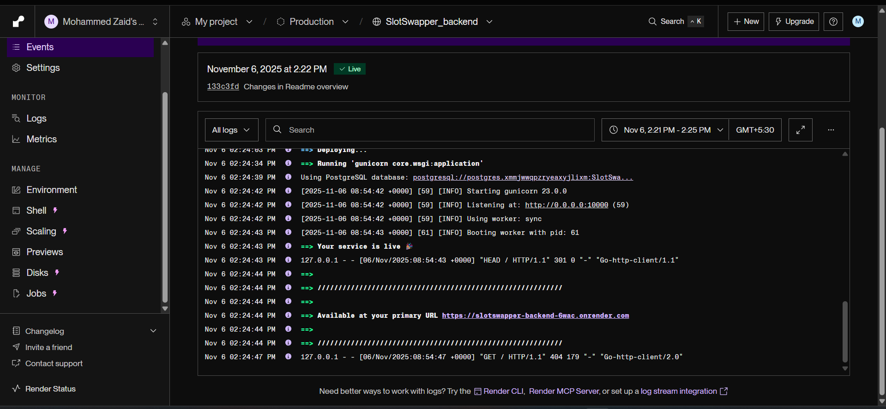
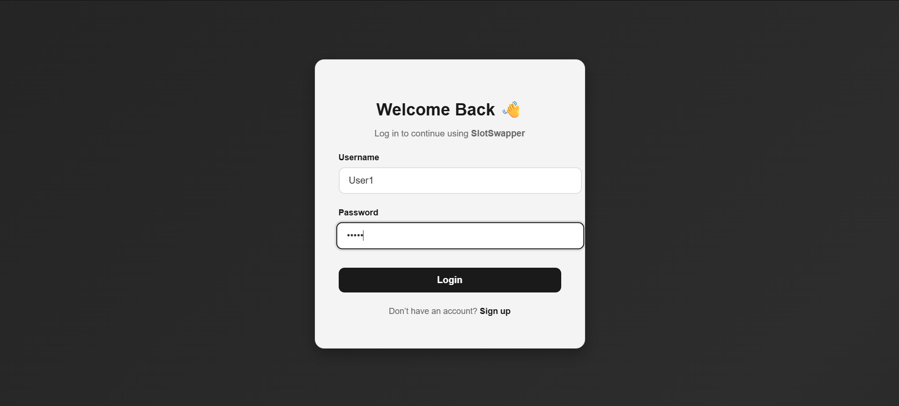
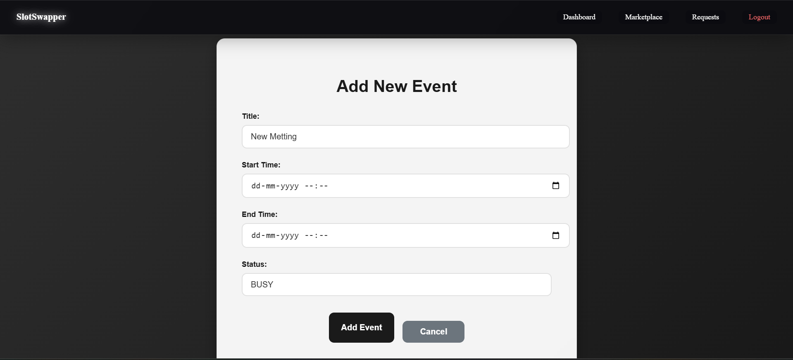
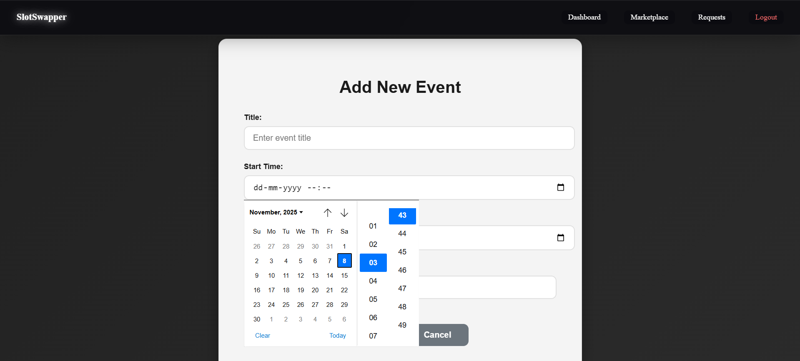
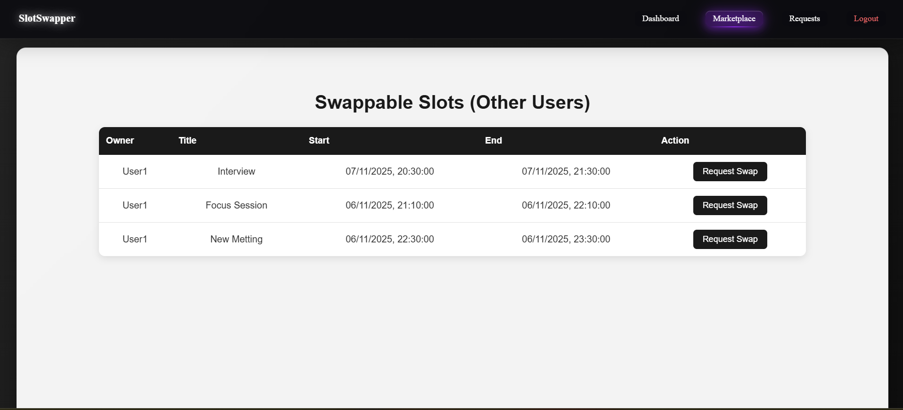
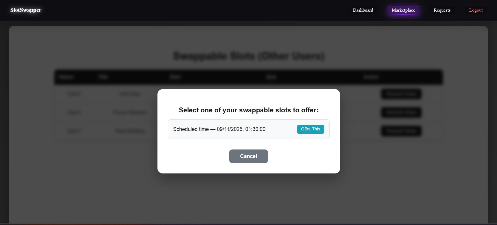
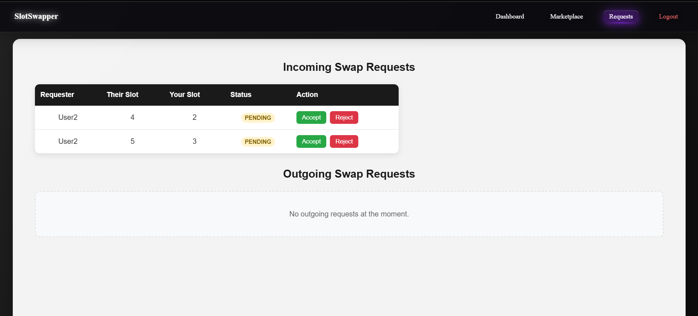
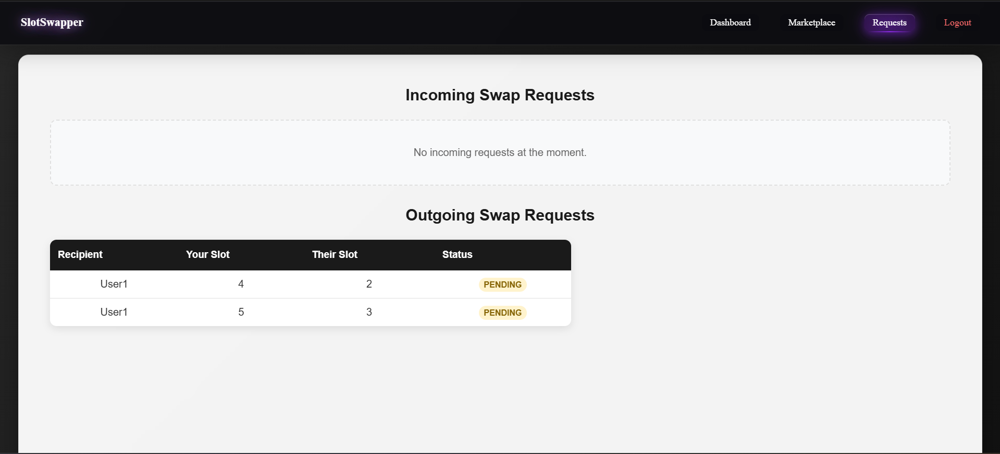

# 🔄 SlotSwapper

A web application that helps users manage and swap time slots for events. Built with React (frontend) and Django REST Framework (backend).

<!-- Live demo banner: update the URL below if your production URL differs -->
<p align="center">
   <a href="https://slot-swapper-sandy.vercel.app" target="_blank" rel="noopener noreferrer">
      <strong style="font-size:18px">Visit the Live Site → https://slot-swapper-sandy.vercel.app</strong>
   </a>
</p>

## Table of Contents

1. [General Information](#1-general-information)
2. [Requirements](#2-requirements)
3. [Installation](#3-installation)
4. [Usage](#4-usage)
5. [API Endpoints](#5-api-endpoints)
6. [Project Structure](#6-project-structure)
7. [Deployment](#7-deployment)
8. [Future Enhancements](#8-future-enhancements)
9. [Contact](#9-contact)

## 1. General Information

🎯 Project Overview

SlotSwapper is a collaborative time-management platform that enables users to exchange their scheduled time slots effortlessly. Instead of rescheduling manually, users can mark specific calendar events as available for swap, explore others’ swappable slots, and seamlessly trade times that better fit their day — all within a few clicks.

💡 How It Works

- **Mark Availability** – A user flags one of their events (for example, “Client Review” from 10:00–11:00 AM Tuesday) as Swappable.
- **Discover Matches** – The user browses a shared marketplace displaying other users’ available swappable slots.
- **Request Swap** – They find a suitable slot (e.g., another user’s Focus Session on Wednesday 2:00–3:00 PM) and send a swap request.
- **Accept or Decline** – The recipient receives a notification and can accept or reject the request.
- **Automatic Update** – Upon acceptance, both users’ schedules are instantly updated with the new event times — no confusion, no overlap.


🚀 Why SlotSwapper

- Eliminates the hassle of rescheduling through back-and-forth messaging.
- Keeps calendars synchronized automatically.
- Encourages flexible, cooperative scheduling among teams or peers.
- Designed for professionals, students, and anyone managing shared time slots.


### Features
- User authentication with JWT tokens
- Create and manage personal events
- Browse available slots in the marketplace
- Request and accept slot swaps
- Real-time status updates for swap requests
- Responsive design for desktop and mobile


## 2. Requirements

### Frontend
- Node.js (v18+)
- React 19.x
- React Router DOM 7.x
- Axios for API requests
- Vite as build tool

### Backend
- Python 3.13
- Django 5.2
- Django REST Framework
- SimpleJWT for authentication
- PostgreSQL (production)
- SQLite (development)

### Tech Stack

Below is a concise breakdown of the main technologies used by the project.

Backend

| Technology | Version | Purpose |
|---|---:|---|
| Python | 3.11+ | Programming language |
| Django | 5.2+ | Web framework and REST support |
| Django REST Framework | 3.15+ | API toolkit |
| djangorestframework-simplejwt | 5.x | JWT authentication |
| PostgreSQL | 12+ | Production relational database |
| psycopg (psycopg[binary]) | 3.x | PostgreSQL driver (binary wheel) |

Frontend

| Technology | Version | Purpose |
|---|---:|---|
| React | 18+ | UI library |
| React Router DOM | 6+ | Client-side routing |
| Axios | 1.x | HTTP client |
| Vite | 4+ | Development/build tool |
| CSS3 | - | Styling with modern features |


## 3. Installation

### Backend Setup

1. **Clone the repository**
   ```bash
   git clone https://github.com/Zaid-S-Pathan/SlotSwapper.git
   cd SlotSwapper/Backend
   ```

2. **Set up Python environment**
   ```bash
   python -m venv env
   source env/bin/activate  # On Windows: .\env\Scripts\activate
   pip install -r requirements.txt
   ```

3. **Configure environment**
   - Copy `.env.example` to `.env`
   - Update settings (database, secret key, etc.)

4. **Run migrations**
   ```bash
   python manage.py migrate
   ```

5. **Create superuser**
   ```bash
   python manage.py createsuperuser
   ```


### Frontend Setup

1. **Navigate to frontend directory**
   ```bash
   cd ../frontend
   ```

2. **Install dependencies**
   ```bash
   npm install
   ```

3. **Configure environment**
   - Set up `.env` with your backend API URL
   ```
   VITE_API_URL=http://localhost:8000
   ```

4. **Start development server**
   ```bash
   npm run dev
   ```


## 4. Usage

### User Registration & Login
1. Visit the signup page to create an account
2. Log in with your credentials
3. You'll be redirected to your dashboard
#### User registration

#### Login


### Creating Events
1. Click "Add Event" in your dashboard
2. Fill in event details (title, time, etc.)
3. Choose if the slot is available for swapping





### Marketplace

The Marketplace is the central place to discover slots other users have marked as swappable. It's designed to make matching and requesting swaps fast and clear.

- Browse a live list of swappable slots from other users.
- Filter by date, time range, owner, or status to quickly find suitable matches.
- Click any slot to open a detail view with the full event title, owner, time window, and any notes.
- When you find a match, click "Request Swap", pick which of your own swappable slots to offer, and send the request.
- Requests the recipient sees will appear in their Requests view where they can Accept or Decline. Status updates (PENDING → ACCEPTED / REJECTED) are shown in both users' dashboards.



### Requesting Swaps
1. Browse available slots in the Marketplace
2. Select a slot you want
3. Choose your slot to offer in exchange
4. Submit swap request



## 5. API Endpoints

### Authentication Endpoints

| Method | URL | Description | Request Body |
|--------|-----|-------------|--------------|
| POST | `/api/register/` | Register new user | `{ "username": "user", "email": "user@example.com", "password": "pass" }` |
| POST | `/api/token/` | Get JWT tokens | `{ "username": "user", "password": "pass" }` |

### Event Endpoints

| Method | URL | Description | Request Body |
|--------|-----|-------------|--------------|
| GET | `/api/events/` | List user's events | - |
| POST | `/api/events/` | Create new event | `{ "title": "Event", "start_time": "...", "end_time": "...", "status": "BUSY" }` |
| PATCH | `/api/events/<id>/` | Update event | `{ "status": "SWAPPABLE" }` |

### Swap Request Endpoints

| Method | URL | Description | Request Body |
|--------|-----|-------------|--------------|
| POST | `/api/swap-request/` | Create swap request | `{ "my_slot_id": 1, "their_slot_id": 2 }` |
| POST | `/api/swap-response/<id>/` | Respond to request | `{ "accept": true }` |


## 6. Project Structure

```
SlotSwapper/
├── Backend/
│   ├── api/
│   │   ├── models.py
│   │   ├── views.py
│   │   ├── urls.py
│   │   └── serializers.py
│   ├── core/
│   │   └── settings.py
│   └── requirements.txt
│
└── frontend/
    ├── src/
    │   ├── components/
    │   ├── pages/
    │   └── App.jsx
    ├── package.json
    └── vite.config.js
```

## 7. Deployment

### Backend (Render)
1. Create a new Web Service
2. Connect your GitHub repository
3. Configure environment variables:
   - ALLOWED_HOSTS
   - DATABASE_URL
   - SECRET_KEY
   - DEBUG=False

### Frontend (Vercel)
1. Import your repository
2. Configure environment variables:
   - VITE_API_URL (production backend URL)
3. Deploy and verify rewrite rules work


## 8. Future Enhancements

Here are some ideas and planned improvements for SlotSwapper. These are optional features that would enhance usability, reliability, and collaboration:

- Notifications
   - Push / email notifications for incoming swap requests and responses.
   - In-app notification center with read/unread state.

- Calendar Integrations
   - Two-way sync with Google Calendar, Outlook, and iCal so accepted swaps update external calendars.

- Search & Filters
   - Advanced filtering (duration, tags, location, time zone) and saved searches.

- Analytics & Audit
   - Admin dashboard with swap activity, user growth, and audit logs for swaps.

- Performance & Scaling
   - Background jobs for heavy tasks (notifications, analytics) and a scalable deployment setup (worker queues, caching).

- Security & Privacy
   - Rate limiting, stricter validation, and privacy controls for who can see swappable slots.

- UX Improvements
   - Guided onboarding, tooltips, and improved error messages to reduce friction.


## 8. Contact

- **Email:** mohammedzaid.s.pathan@gmail.com
- **GitHub:** [Zaid-S-Pathan](https://github.com/Zaid-S-Pathan)
- **Project Link:** [GitHub](https://github.com/Zaid-S-Pathan/SlotSwapper),[SlotSwapper(Live Link)](https://slot-swapper-sandy.vercel.app/)


---

Screenshots needed:
1. Homepage/Dashboard overview
2. Backend setup success
3. Frontend development server
4. Signup/Login interface
5. Event creation form
6. Swap request workflow
7. API response example
8. Deployed application view